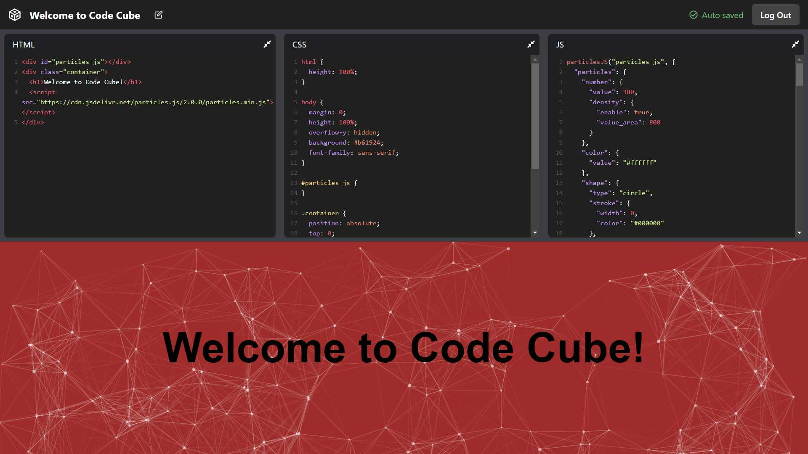

<!-- PROJECT LOGO -->
<div align="center">
  <h1 align="center">Code Cube</h3>
  
</div>

<!-- ABOUT THE PROJECT -->

## About This Project

Code Cube is an online front‑end development live code editor for prototyping with HTML, CSS, and JavaScript. Authentication is implemented using GitHub and Google OAuth providers. View live demo at <a href="https://code-cube.garyxie.me/" target="_blank">code-cube.garyxie.me</a>.

#### Built With

- Go
- MongoDB
- React
- TypeScript
- Next.js

## Future Enhancements Roadmap

- [ ] Add real-time live code updates with WebSockets
- [ ] Allow user to invite other users to cubes in order to allow for collaboration
- [ ] Allow user to configure adding JavaScript packages from a CDN (e.g. CDNjs, Unpkg)
- [ ] Create a landing page to showcase the application's features, instead of immediately redirecting user to Login page
- [ ] Add a Grid view for viewing cubes, including a screenshot of the project for better UX
<!-- - [ ] Look into using Quill.js + Highlight.js for Deltas (to improve functionality for realtime collaboration changes)
- [ ] Replace Auth solution from Next-Auth to Go solution (so that auth is handled in the same server as the backend server) -->

<!-- GETTING STARTED -->

## Getting Started

#### Installation and Set Up

1.  Clone the repository.
    ```sh
    git clone https://github.com/GaryJX/code-cube.git
    ```
2.  `cd` into the `client` directory.
    ```sh
    cd code-cube/client
    ```
3.  Install client dependencies.
    ```sh
    npm install
    ```
4.  Create `.env.local` by copying the template file `.env.sample`.
    ```sh
    cp .env.sample .env.local
    ```
5.  Update your `.env.local` file with environment variables

    ```
    # .env.local

    NEXTAUTH_URL=http://localhost:3000
    NEXT_PUBLIC_BACKEND_API_URL=http://localhost:8080

    # Optional parameters for setting up OAuth authentation and saving sessions to DB
    GITHUB_CLIENT_ID=
    GITHUB_CLIENT_SECRET=
    GOOGLE_CLIENT_ID=
    GOOGLE_CLIENT_SECRET=
    MONGODB_URI=
    MONGODB_DB=
    ```

6.  Start the front-end development server.
    ```sh
    npm run dev
    ```
7.  Try out the guest editor at http://localhost:3000/editor/guest.
    <br>
8.  In a new terminal, `cd` into the `server` directory.
    ```sh
    cd server
    ```
9.  Install server dependencies.
    ```sh
    npm install
    ```
10. Create `.env` by copying the template file `.env.sample`.

    ```sh
    cp .env.sample .env
    ```

11. Update your `.env` file with environment variables.

    ```
    # .env

    CLIENT_URL=http://localhost:3000
    DB_URI=mongodb://localhost:27017
    DB_NAME=codeCube
    ```

12. Start the back-end development server.

    ```sh
    go run main.go
    ```

#### Production Deployment

- The `client` folder containing the front-end code is hosted on [Vercel](vercel.com), and is automatically rebuilt whenever a commit is pushed to the `main` branch
- The `server` folder containing the server-side code is hosted on [Heroku](https://heroku.com/). To trigger a re-deployment, push the changes to Heroku's remote Git repository:

  ```sh
  git subtree push --prefix server heroku main
  ```

<!-- ## Routes

#### Frontend

- Login: `/login`
  - Centered modal form to allow the user to log in/register (with OAuth providers or Email?)
  - Redirects to `/` if user is already logged in
- Homepage: `/`
  - Shows the index page, containing a list of Code Cubes that the user is created, and they can add/delete cubes here
  - Redirects to `/login` if user is not logged in
- Editor: `/editor/<id>`
  - The main editor page, allowing the user to edit the HTML/CSS/JS of the cube and see the rendered page.
  - Also see if I can allow importing packages from `cdnjs`, `unpkg`, or `jsdelivr`
  - Redirects to `/login` if user is not logged in
- (Lower Priority) Landing Page: `/<todo: replace Homepage with another endpoint>`
  - A landing page to display the functionality of the application

#### Backend

- Cubes List: `/api/cubes` (GET)
  - Gets a list of the all of the cubes available to the user
- Create New Cube: `/api/cube` (POST)
- Get Cube: `/api/cube/<id>` (GET)
  - TODO: Change this endpoint to a WebSocket connection instead
- Edit Cube: `/api/cube/<id>` (PUT)
  - TODO: Change this to a PATCH method instead to allow for incremental and separate changes to HTML, CSS, JS, and packages
- Delete Cube: `/api/cube` (DELETE) -->
